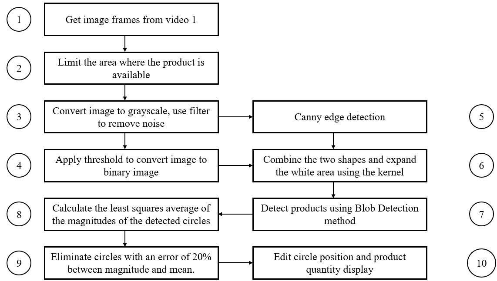

# Product detection based on Blob Detection
This source code demonstrates a method I have worked on to detect industrial products that provide the number of products appearing in the camera frame.
I use image preprocessing methods, then feed into Blob Detection with optimally tuned parameters. You can refer to the results in the "image" folder.

## I. Introduction

Product counting is a common problem in many machine vision applications. Especially in manufacturing systems operating at high speeds, it is difficult to make measurements without using computer vision. Therefore, the use of machine vision systems becomes necessary. In these applications, products passing through the conveyor belt are recorded through one or more cameras, and images are processed to detect product quantities.

## II. Methods

Here, I have 2 videos to check the results of running my code. Each video is different, so I have a different approach for each video, but the foundation for developing them is pretty similar. You will easily see when using the source code.

I use a circle detection method called Blob Detection. However, you can research another method called HoughCircles. I hope this will help you improve your results.

 
    
 

<b><i>Algorithmic flow chart</i></b>

